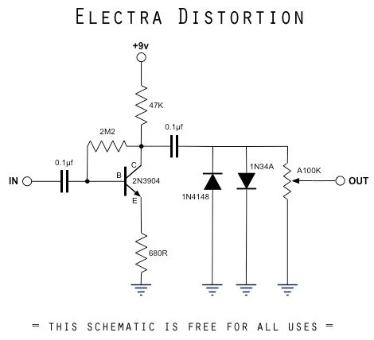
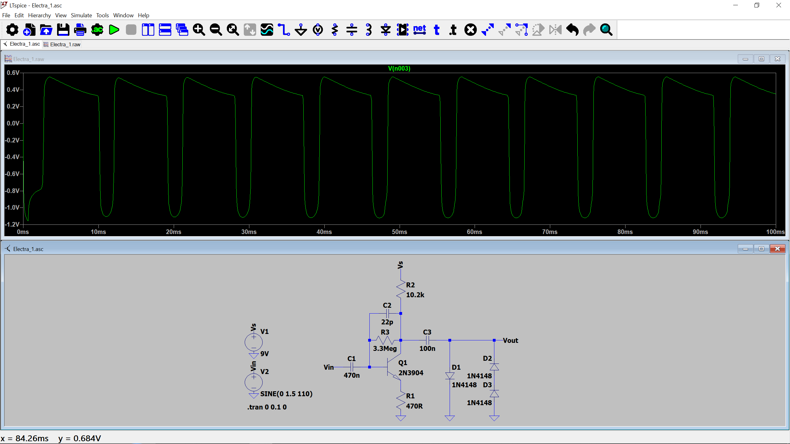
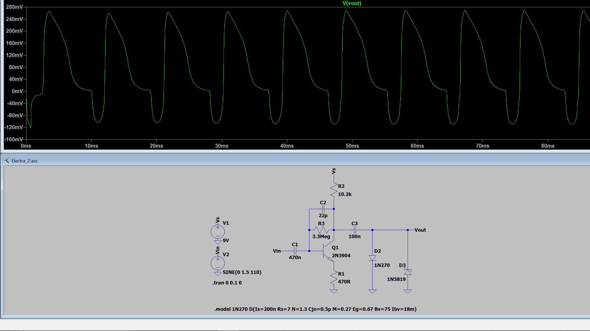
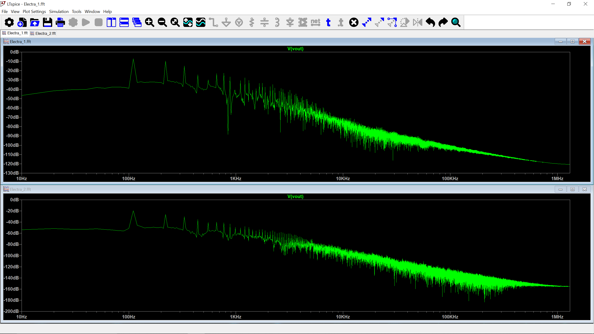

# Electra Distortion Pedal
The electra distortion pedal consists of a common emitter gain stage using a NPN BJT into a diode clipping stage, and it
sounds quite good for its simplicity. 

I used this pedal schematic I found off of the r/diypedals reddit thread as a reference:

## First Attempt Using 3 1N4148 Diode Clipping Stage
Some changes I made to the schematic include adding a very small ceramic capacitor in parallel with the feedback resistor  to increase negative feedback at high frequencies, 
reducing high-frequency gain to get rid of some harsh treble fizz. The diode clipping stage in the reference schematic uses a 1N4148 and a 1N34A diode. While the 1N4148 is a 
standard silicon diode with a 0.6 - 0.7 V voltage drop, the 1N34A is a germanium diode with a smaller voltage drop, roughly 0.2 - 0.3 V, meaning the signal is clipped 
asymmetrically. Asymmetrical clipping is good for saturating the guitar signal because it introduces even-order harmonics to the signal as well as reduces overall compression, 
creating a warm and responsive tone. I did not have a 1N34A diode on hand, so in an attempt to emulate the reference clipping stage, my asymmetrical clipping configuration consists 
of three 1N4148 silicon diodes in a 2+1 parallel arrangement. Since the forward voltage of the 1N4148 is a bit high, the circuit struggled to reach an obvious clipping of the signal. 
This is something I will try to modify in subsequent iterations of this distortion circuit.

I used a potentiometer to find a good resistance value to properly bias the 2N3904 to ~4.5 V, since there are minor variations due to error between transistors. The value I
landed on was ~10.2kΩ which is seen in the LTSpice schematic. I used a transient simulation of a 110 Hz sine wave with a 1.5 V amplitude (analogous to strumming the open A
string, though 1.5 V is probably a little high but the diode clips the signal more noticeably at higher voltage)

(recorded using Scarlett 2i2 audio interface and Audacity)

The first 30 seconds of the recording is just my raw guitar signal and the rest is recorded with the distortion circuit. As expected, I had to strum pretty hard in order to
achieve noticable clipping.

## Second Attempt Using 1N270 and 1N5819 Diode Clipping Stage
After getting a germanium diode, and swapping the 1N4148 diode for a 1N5819 diode, the circuit clips much faster. This is because the 1N270 germanium diode has a typical forward 
voltage drop of 0.2 - 0.3 V at low currents, while the 1N5819 Schottky diode drops about 0.3 - 0.4 V under similar conditions, which is significantly lower voltage than the previous
1N4148 diodes.

The LTSpice circuit and simulation as well as the breadboarded second attempt circuit!

The fast signal clipping is extremely obvious in the recording: 

The silicon diodes only turn on at the very peaks of the wave. For most of the cycle, the diodes are completely off, allowing the transistor switch very fast. The germanium and
Schottyky diodes, however, start conducting a tiny bit of current early on and gradually conduct more as the voltage rises. Since they are conducting during almost the entire cycle,
The 100nF capacitor need to charge and discharge more, making slightly flattening steeper changes.

This is evident when I compare the twos FFTs. 
